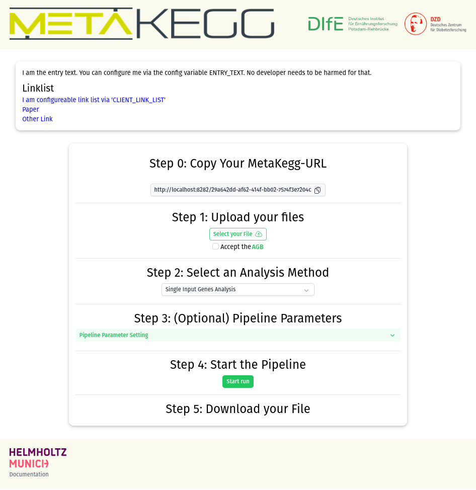

# MetaKeggWeb

Web interface for https://github.com/dife-bioinformatics/metaKEGG



- [MetaKeggWeb](#metakeggweb)
- [Install and Run](#install-and-run)
  - [Option1: Run with prebuild container](#option1-run-with-prebuild-container)
    - [Download](#download)
    - [Run](#run)
    - [Usage](#usage)
  - [Option2: Build and run with Docker](#option2-build-and-run-with-docker)
    - [Download](#download-1)
    - [Building](#building)
    - [Start](#start)
    - [Usage](#usage-1)
  - [Option3: Build and run locally](#option3-build-and-run-locally)
    - [Download](#download-2)
    - [Build Server](#build-server)
    - [Build Client](#build-client)
    - [Start](#start-1)
    - [Usage](#usage-2)
- [Configuration](#configuration)
  - [Via environment Variable](#via-environment-variable)
  - [Via Yaml file](#via-yaml-file)
    - [Local](#local)
    - [Docker](#docker)
- [Notes on running in production](#notes-on-running-in-production)


# Install and Run

> [!IMPORTANT]  
> This project is intended to run in  a Linux/Unix environment. It should also be able to run in a MS Windows environment but was not tested yet. There may be still bugs regarding Path resolutions on MS Windows.


##  Option1: Run with prebuild container

> [!WARNING]  
> Work in Process: This needs [MetaKegg](https://github.com/dife-bioinformatics/metaKEGG) to be public. There is no public pre-build container yet.


### Download

`docker pull dzdde/metakeggweb` 

### Run

`docker run -p 8282:8282 dzdde/metakeggweb` 

### Usage

visit http://localhost:8282 to use the MetaKegg WebClient

visit http://localhost:8282/docs to see the OpenAPI Rest Specification

##  Option2: Build and run with Docker

> [!WARNING]  
> Work in Process: This needs [MetaKegg](https://github.com/dife-bioinformatics/metaKEGG) to be public. Otherwise its not downloadable and installable by the Docker build process.

**requirements**

* `git` for downloading the project 
  *  https://www.python.org/downloads/
* `docker` For building and running the project
  * https://docs.docker.com/engine/install/

### Download

`git clone git@github.com:DZD-eV-Diabetes-Research/meta-kegg-web-wrapper.git`

`cd meta-kegg-web-wrapper`

### Building

`docker build . -t metakeggweb`

### Start

`docker run -p 8282:8282 metakeggweb` 

### Usage

visit http://localhost:8282 to use the MetaKegg WebClient

visit http://localhost:8282/docs to see the OpenAPI Rest Specification


##  Option3: Build and run locally

**requirements**

* `git` for downloading the project 
  *  https://www.python.org/downloads/
* `python` >= v.3.11 for building and running the server
  * https://www.python.org/downloads/
* `bun` for building the Webclient 
  * https://bun.sh/docs/installation

### Download

`git clone git@github.com:DZD-eV-Diabetes-Research/meta-kegg-web-wrapper.git`

`cd meta-kegg-web-wrapper`

### Build Server

`python -m pip install -r ./backend/requirements.txt -U`

There are some mandatory config setting we need to set.
create a .env file at `backend/mekeweserver/.env`
Write this content into the file `backend/mekeweserver/.env`

```
SERVER_HOSTNAME=localhost
```

### Build Client


Download and install depencencies for client  

`(cd frontend && bun install)`

Build static pages for the client  

`(cd frontend && bunx nuxi generate)`


### Start

Finally we can start the MetaKegg Webserver with:

`python backend/mekeweserver/main.py`

### Usage

visit http://localhost:8282 to use the MetaKegg WebClient

visit http://localhost:8282/docs to see the OpenAPI Rest Specification


# Configuration

MetaKegg has a range of configuration variables. Most are set to sane default values.

Have a look at [config.template.yaml](config.template.yaml) to see a template with all possible configuration parameters.

## Via environment Variable

You can set any configuration variable via env vars. This is convenient via Docker

For example lets define the log level in our instance.

`docker run -p 8282:8282 -e LOG_LEVEL=INFO metakeggweb` 

## Via Yaml file

If you want to MetaKeggWeb to use a custamized config yaml file, set the environment variabel `MEKEWESERVER_YAML_CONFIG_FILE` with a path pointing to your yaml.

Lets create a config yaml first

`C:\tmp\config.yaml`/`/tmp/config.yaml`
```yaml
LOG_LEVEL: INFO
PIPELINE_RUNS_CACHE_DIR: /tmp/mekewe_cache
```

### Local

Now we want to set `MEKEWESERVER_YAML_CONFIG_FILE` to point to our yaml file

On MS Windows:
`set MEKEWESERVER_YAML_CONFIG_FILE="C:\tmp\config.yaml"`

On *nix:
`export MEKEWESERVER_YAML_CONFIG_FILE="/tmp/config.yaml"`


If we now start our webserver with  
`python backend/mekeweserver/main.py`  
Our `config.yaml` will be taken into account.

### Docker

With docker we only need to mount our `config.yaml` into the `config` directory.

`docker run -p 8282:8282 -v /tmp/config.yaml:/config/config.yaml metakeggweb` 


# Notes on running in production

MetaKeggWeb uses a Redis server for interprocess communication.  
If no Redis server is provided, the Webserver will run an instance of [`fakeredis`](https://pypi.org/project/fakeredis/).
This is fine for running a local demo. 
  
For a productive instance you should attach a real Redis instance to the server.
Have a look at our [`docker-compose.yaml`](docker-compose.yaml) reference file to see how to do it.
